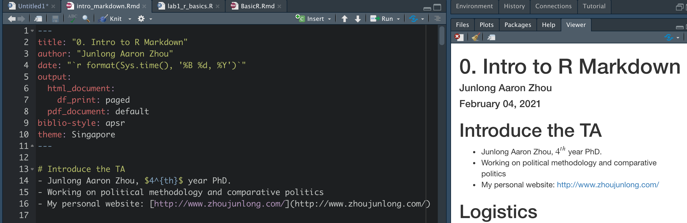

# Introduce the TA
- Junlong Aaron Zhou, $4^{th}$ year PhD.
- Working on political methodology and comparative politics 
- My personal website: [http://www.zhoujunlong.com/](http://www.zhoujunlong.com/)
- Email: **jlzhou@nyu.edu**


# Logistics
- Lab: Fridays, 12:30 - 14:30 EST
  - Recording will be posted after class.
  - Materials can be find at [[github repo](https://github.com/zjl0714/Quant2_lab_2021sp)]
- Office hours: Mondays 16-18 EST; Tuesdays 9-10 EST 
  - book my office hour [[here](https://calendly.com/jlzhou/15min)]

\pause

- All homework will be submitted in soft copy (pdf) to both Cyrus and me
- **Code should be well commented**
- Only accept high quality tables and plots

# Plan

- R Markdown
- Basic R
- Extra Basic R (time allows)

# Install R
- It depends on whether you are a Mac or Windows user
- For MAC, go to [http://cran.r-project.org/bin/macosx/](http://cran.r-project.org/bin/macosx/)
- For Windows, go to [http://cran.r-project.org/bin/windows/base/](http://cran.r-project.org/bin/windows/base/)
- You should choose an editor and learn how it works
  - One common choice is RStudio, but there is vim, emacs, Notepad++, etc.


# When things break
- Documentation - Ex: `?lm`
- [Google](http://google.com)
- CRAN (Reference manuals, vignettes, etc) - Ex: [http://cran.r-project.org/web/packages/AER/index.html](http://cran.r-project.org/web/packages/AER/index.html)
- JSS - Ex: [http://www.jstatsoft.org/v27/i02](http://www.jstatsoft.org/v27/i02)
- Stack Overflow - [http://stackoverflow.com/questions/tagged/r](http://stackoverflow.com/questions/tagged/r)
- Listservs - [http://www.r-project.org/mail.html](http://www.r-project.org/mail.html)

# Resources
- [The Art of R Programming](http://heather.cs.ucdavis.edu/~matloff/132/NSPpart.pdf) - N. Matloff
- [Modern Applied Statistics with S](http://www.stats.ox.ac.uk/pub/MASS4/) - W. Venables and B. Ripley
- [Advanced R Programming](http://adv-r.had.co.nz/) - H. Wickham
- [The R Inferno](http://www.burns-stat.com/documents/books/the-r-inferno/) - P. Burns
- [Rdataviz](https://github.com/pablobarbera/Rdataviz) - a talk by P. Barberá on ggplot2
- [Basic Intro to R](https://github.com/pablobarbera/NYU-AD-160J/tree/master/lab1) - also by P. Barberá
- [Jamie Monogan](http://spia.uga.edu/faculty_pages/monogan/r.php)


# What is R Markdown?

R Markdown is a tool within RStudio that allows you to write documents, presentations, or webpages and combine written text with code. The text in the document can be fully formatted, and you can choose to make your code visible or not. Documents can be output as PDFs, Word Documents, HTML, and other formats.


# Why people use R Markdown?

- It has all the advantages of LaTeX
- Everything (analysis + texts + graphs + tables) is on one place.
- The document changes when the data gets updated (this is very important).
- Better bibliography system 

# What if I prefer STATA?

- You can still use Markdown via [Stata Markdown](https://data.princeton.edu/stata/markdown/) 
  - Markdown is a language and R Markdown is just one realization of it.
  - Stata Markdown is similar.
  
- To export results, you can try [`outreg`](https://www.princeton.edu/~otorres/Outreg2.pdf) in STATA

- Nevertheless, we focus on R in this class.

# Getting started

It is very easy. You of course need to download R, RStudio. In newer versions you don't need to install anything else, however, you might need to install packages once (knitr, rmarkdown), and you may need some distribution of LaTeX if you want pdf output. 

Once you have done all that, 

1. Open RStudio
2. Select File > New File > R Markdown
3. Enter Title, Author, Output Format (which can easily be changed later)
4. You are good to go! You will see that there is some example text that you can delete. 

## Markdown document

The documents typically have four different pieces: the YAML, the formatted text, code chunks, and inline code. 


# YAML

At the beginning of any R Markdown script is a YAML header section enclosed by ---.
This includes a title, author, date and the type of output you want to produce. Many other options are available for different functions and formatting, like beamer_presentation, pdf_document, html_document, etc. Take a look [[here](https://rmarkdown.rstudio.com/lesson-9.html)] at all the available output formats. Rules in the header section will alter the whole document.

You will always insert something like this at the top of your new .Rmd script:

```
---
title: "0. Intro to R Markdown"
author: "Junlong Aaron Zhou"
date: "`r format(Sys.time(), '%B %d, %Y')`"
output: html_document
---
```

# Code chunks

Code chunks are the best part of R Markdown. The code you enter is executed and the results are displayed in the document. 

- The syntax for code chunks looks like this:

```
'''{r}
basic code
'''
```

# Code chunks

Note that these are backticks, not quotes or apostrophes. Everything that goes between these backticks should have R syntax. 

```{r}
x <- runif(10)
y <- rnorm(10, x, 1)
df <- data.frame(x, y)
df
```

# Code chunk options

```
' ' ' {r name, eval=FALSE, warning=FALSE, message=FALSE}  
 CODE GOES HERE  
' ' '
```

- name - A label for your code chunk.
- echo - Whether to display the code chunk or just show the results. If you want the code embedded in your document but don’t want the reader of the document to see it, you can set echo=FALSE
- eval - Whether to run the code in the code chunk.
- warning - Whether to display warning messages in the document.
- message - Whether to display code messages in the document.
- results - Whether and how to display the computation of the results

# Formatted text

It is very easy to format your text in Markdown. 

-  `*italics*` *italics*
-  `**bold**` **bold**
- `~~strikethrough~~`  ~~strikethrough~~
- `[nyu](https://www.nyu.edu/)` [nyu](https://www.nyu.edu/)
- `superscript^2^` superscript^2^

And many more you can find [here](https://www.rstudio.com/wp-content/uploads/2015/02/rmarkdown-cheatsheet.pdf), including headers, lists, etc.

# Equations

Equations use LaTeX notation and you can include them either between single dollar signs (inline equations) or double dollar signs (displayed equations).

We can use inline equations such as `$y_i = \alpha + \beta x_i + e_i$` which is displayed as $y_i = \alpha + \beta x_i + e_i$ .

Or displayed formulas:
```
$$f(x) = \frac{e^{(-x-\mu)^{2}/(2\sigma^{2})}}
{\sigma \sqrt{2\pi}}$$
```
Which looks like this:
$$
\begin{aligned}
f(x) = & \frac{e^{(-x-\mu)^{2}/(2\sigma^{2})}}{\sigma \sqrt{2\pi}} \\
y = & x + 3
\end{aligned}
$$

# Equations

For multiline equations, you need the `aligned` environment:

$$
\begin{aligned}
x & = 2*z + 3 \\
y & = 5*z + 6
\end{aligned}
$$

# Plot
We can also plot figures,

```{r fig, fig.height = 3, fig.width = 3, fig.align = "center"}
plot(x)
```

# Plot

Or attach a picture
```

```


