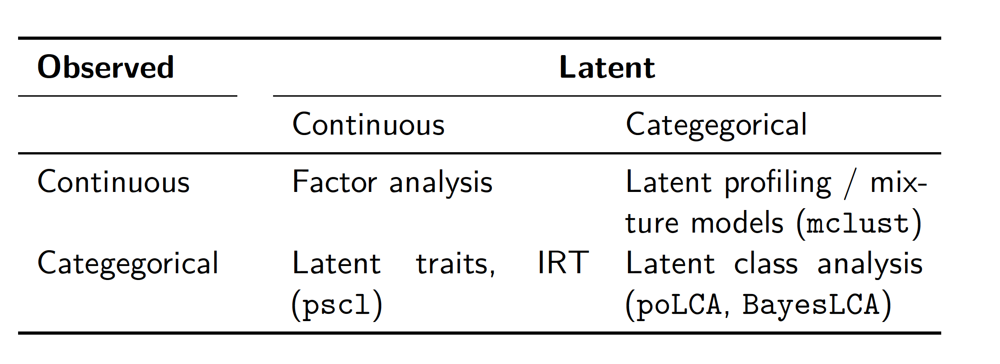

# Outline 
- Multiple Testing
  - Multiple hypothesis
  - Summary Index
  
- Missing Data
  - Classical Approach
  - Modern Approach


# Multiple Hypothesis

- There is a positive probability that you can reject the true null.
```{r simu.null, message=FALSE, warning=FALSE}
B <- 100
t <- sapply(1:B, function(k){
  x <- rnorm(1000)
  y <- rnorm(1000)
  m <- lm(y~x)
  return(lmtest::coeftest(m)[2,3])
})
```

# Multiple Hypothesis
```{r simu.null0, message=FALSE, warning=FALSE}
hist(t)
abline(v=1.96)
abline(v=-1.96)
```

# Adjust the p-value

- As discussed in class, we want to adjust the p-value to control the FWER and FDR
- Suppose we have 10 hypothesis.
```{r simu.null2, message=FALSE, warning=FALSE} 
p <- sort(runif(10))
data.frame(p=p,bonferroni=p.adjust(p, method = "bonferroni"),
           fdr=p.adjust(p, method = "fdr")) 
```

# Adjust the p-value

- This adjustment can be conservative.
- Use bootstrap step-down method discussed in class.
```{r simu.null3, message=FALSE, warning=FALSE} 
# if (!requireNamespace("BiocManager", quietly = TRUE))
#     install.packages("BiocManager")
# BiocManager::install("multtest")
library(multtest) 
N <- 1000
x <- matrix(rnorm(N*10),ncol = 10)
beta <- seq(0,2,length.out = 10)
y <- rnorm(N, mean=x%*%beta,sd=1)
m <- MTP(X=t(x),Y=y, B=10000, seed = 1234, test = "lm.YvsXZ",
         typeone = "fwer")
```

# Adjust the p-value
```{r simu.null4, message=FALSE, warning=FALSE} 
m@adjp
```

# Summary Index

- If we have 10 hypotheses, and 7 of them are rejected, what do we know?
\pause
- e.g. we have 10 different measure of ability in an experiment.
- we find treatment has significantly positive effect on 7 of the measure, but not on the rest 3.
- assume we have perfect measure of them, otherwise we have measurement error problem (Gillen et al 2019).
\pause
- We may want a summary index to capture the ability and to give us an interpretable result.
- We discussed inverse covariance weighting from Anderson (2008) in class.
\pause
- The measurement problem is an important topic in social science.

# Measuring populism (Monkey Cage, Oct 19, 2017)

Borrowed from Arturas -

\pause
- We asked respondents whether they agreed or disagreed with nine statements. Populists should agree that:
    - “Politicians need to follow the will of the people”
    - “The people, and not politicians, should make our most important policy decisions”
    - ...
    - “Regardless of the party in power, all governments just favor the bigwigs.”

- Populists should disagree that:
    - “Politicians care about what people like me think”
    - ...
    - “Those we elect to public office usually try to keep the promises they made during the election”
- We employed a strict definition of populist: Someone who answered all nine questions in the populist direction. We found that 17 percent of Americans are “populists” according to this measure.

# Measurement in social sciences

- Multiple measurements (observables) are used to capture the quantity of interest (latent variable).
- How do we approach this problem in a principled way?
    - Aggregation of measurements (dimension reduction)
    - Measurement error
    - Relating latent variables to other observables

# Types of latent variable




# ICW or other?

- No matter which case, we are working on dimension reduction!
\pause
- Cyrus has some discussion here: [https://cyrussamii.com/?p=2177](https://cyrussamii.com/?p=2177)
\pause
- Suppose you have three variables: College math grade, math GRE, and verbal GRE.
- ICW will give 25% weights to each of the math scores and 50% to the verbal score.
- PCA will generate two (or more) new variables, one for mathematical capability and the other for linguistic capability.
- Which one is more proper depends on the context.
\pause
- Do we want a latent variable to capture the "ability" or other?

# Item Response Theory (IRT)
 
- Say we want to estimate the ideology:
- A spatial model of voting behavior.
- Estimate model from data (structural estimation).
- Item Response Theory (IRT): for $i = 1, ..., N$ legislators (students) you observe $j = 1, ..., n$ binary votes (test answers).
\begin{align}
y_{ij} & \sim Bernoulli(\pi_{ij}),\\
\pi_{ij} & =  \Phi(\beta_j \theta_i - \alpha_j)
\end{align}
- $\theta_i$: ideal point (ability)
- $\alpha_j$: item difficulty
- $\beta_j$: item discrimination

# Principle Component Analysis (PCA)

- PCA is specifically for dimension reduction
- Idea: extract more information from $X$ as possible.
\pause
- Suppose we have $x_1,\dots,x_M$, $M$ features.
- We define the generated $y_1,\dots,y_K$ are $K$ principle component. 
\pause
- The first principle component explains the most variation, and then the second, etc.
- the principle component are orthogonal to each other.

# Principle Component Analysis (PCA)

- Specifically, $y_k=\underset{j\in\{1,\dots M\}}{\sum} \alpha_{j,k}x_j$
- One can show that $\{y_k\}$ is the principle component and:
  - it explains $\lambda_k$ variation of $X$, where $\lambda_k$ is $k^{th}$ large eigen-value of $X$
  - $\alpha_k$ is $k^{th}$ of $X$'s eigen-vector associated with $\lambda_k$.

# Principle Component Analysis (PCA)
- As one may know, any linear transformation is a coordinate transformation.


# Principle Component Analysis (PCA)

- Easy to implement it in R
- Note we also need to standardize the data.
```{r pca, message=FALSE, warning=FALSE}
summary(pc.cr <- princomp(mtcars, cor = TRUE))
```

# Principle Component Analysis (PCA)
```{r pca2, echo=FALSE, warning=TRUE}
library(factoextra)
fviz_eig(pc.cr)
```

# Missing Data

- Estimation for bounds
  - Manski Bound
  - Lee Bound
  
- Point estimation
  - Missing data imputation
  
# Bound Estimation

- We put the least assumption on missing data.
\pause
- For example: Lee bound.
  - Assume monotonicity: $S_{1i}\geq S_{0i},\forall i$ or the other direction.
  
\pause
- Control group: only observe one strata ($S_1=S_0=1$)
- Treated group: observe two strata ($S_1=S_0=1$, and $\{S_1=1,S_0=0\}$)
- We can use the treated group to construct the bound for $S_1=S_0=1$ people.

# Lee Bound

- This bound can be tightened: if $\{S_1,S_0\}$ is correlated with $X$.
- Use $X$ to predict the principle strata.
\pause
- e.g. educated people join labor market anyway, but low educated people only join market when they get special training.
- we can use education level to construct a tighten bound.

# Beyond Lee Bound

- Traditional Lee bound only allows few discrete variables.
- because we need to get two quantities
  - $q=Pr(S_1=S_0=1)$
  - $E(Y|D=1, y\geq y_{q}(1))$
- conditional on $X$ causes curse of dimensionality.

\pause
- Semenova (2021) proposes use LASSO to construct a better lee bound 
- Olma (2021) uses kernel method.
- Samii, Wang, Zhou try to use adaptive kernel to incorporate high-dimensional covariate cases.


# Point Identification

- We need to impute the missing value.
\pause
- Missing Completely At Random (MCAR): We are fine.
  - missing is random assigned.

\pause
- Missing At Random (MAR): use $X$ to impute the missing values.
$P(Missing|X_{obs})=P(Missing|X_{complete})$

# Multiple Imputation using Mice

- Note: multiple imputation is fine when we have enough data.
```{r mice1, message=FALSE, warning=FALSE}
n <- 10000
m <- 10 
set.seed(1234) 
x <- matrix(rnorm(n*m), nrow=n)
x <- cbind(1,x)
beta <- rnorm(m+1, mean=0, sd=3)
y <- rnorm(n, mean=x%*%beta)
beta_missing <- rnorm(m+1, mean=0, sd=3)
missing <- rbinom(n,size=1, prob= 1/(1+exp(x%*%beta_missing)))
missing_ind <- which(missing==1)
y_obs <- y
y_obs[missing_ind] <- NA 
```

# Multiple Imputation using Mice

```{r mice, message=FALSE, warning=FALSE}
dat <- as.data.frame(cbind(y_obs,x))
library(mice)
m1 <- mice(dat, maxit = 100, printFlag = FALSE)
dat_imp <- complete(m1)
plot(y[missing_ind]~ dat_imp$y_obs[missing_ind]) 
```


# Multiple Imputation using Mice

```{r mice2, message=FALSE, warning=FALSE}
# True beta
beta
# with observed data
coef(lm(y[-missing_ind] ~ x[-missing_ind,]))
# with Imputed data
summary(with(m1,lm(y~x)))
```

# Not MAR?

- Consider we care about people's attitude towards Trump
- People may refuse to report
- This "not report" is correlated with their underlying attitude towars trump
\pause
- Missing is not random.
- $P(Missing|X_{obs})\neq P(Missing|X_{complete})$
\pause
- Liu (2020) proposes a latent factor model a missing not at random case. 

# Remarks

- Causal inference is a missing data problem.
\pause
- We can always apply what we learn from basic causal inference to missing data problem
  \pause
  - Model assumption?
  - Random assignment (missingness) or CIA?
  - etc.

\pause
- Deal with missing data carefully. 

# Remarks

\begin{center}
\includegraphics[height=.6\linewidth]{missing.jpg} 
\end{center}    
  