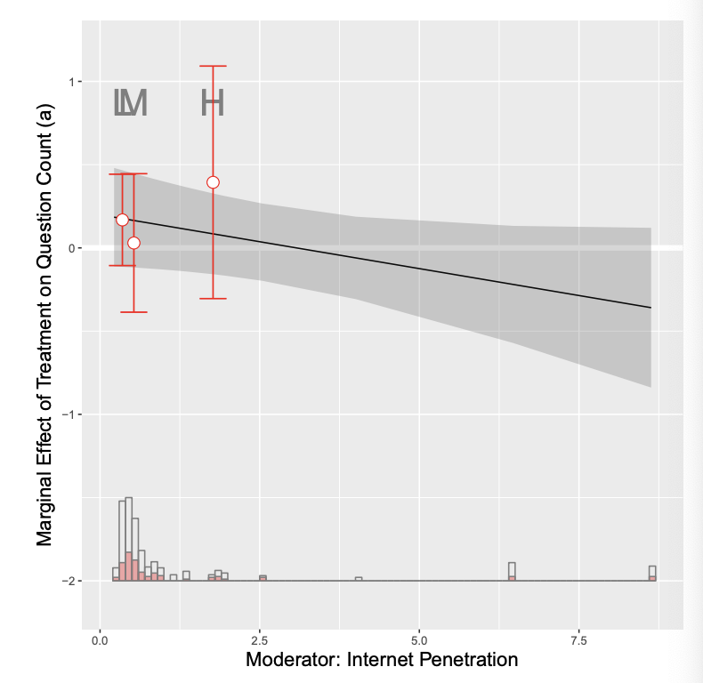

# Today's plan 
- Regression
- Effective samples
- Causal inference from a machine learning perspective
  
# Covariate Adjustment in sampling
- Imagine that we are biologists who are interested in leaf size.
- Finding the size of leaves is hard, but weighting leaves is easy.
- We can use auxilliary information to be smarter:
    - Sample from leaves on a tree.
    - Measure their size and weight.
    - Let $\bar{y}_s$ be the average size in the sample.
    - Let $\bar{x}_s$ be the average weight in the sample.
    - We know that $\bar{y}_s$ unbiased and consistent for $\bar{y}$
    - But we have extra information!
    - We also have $\bar{x}$ (all the weights)
    - This motivates the regression estimator:  
    $\hat{\bar{y}} = \bar{y}_s + \beta(\bar{x}-\bar{x}_s)$
    - We get $\beta$ by a regression of leaf area on weight in the sample.

# Efficiency from using covariates

```
X1 <- rnorm(N_pop, 3, 1)
X1_demeaned <- X1 - mean(X1)
Y0 <- abs(rnorm(N_pop, 5, 2)) + 3*X1 #+ 0.4*X1^2
Y1 <- Y0 + rnorm(N_pop, 3, 1)
TE <- Y1 - Y0
ATE <- mean(TE)
D <- rbinom(N_pop, 1, 0.3)
Y <- D*Y1 + (1-D)*Y0
reg_formula1 <- paste0(Y.name, "~", D.name)
reg_formula2 <- paste0(Y.name, "~", D.name, "+", X1.name)
reg_formula3 <- paste0(Y.name, "~", D.name, "*", X2.name)

```

# Efficiency from using covariates
```{r cov, echo=FALSE, message=FALSE, warning=FALSE}
require(sandwich)
N_pop <- 100
X1 <- rnorm(N_pop, 3, 1)
X1_demeaned <- X1 - mean(X1)
Y0 <- abs(rnorm(N_pop, 5, 2)) + 3*X1 #+ 0.4*X1^2
Y1 <- Y0 + rnorm(N_pop, 3, 1)
TE <- Y1 - Y0
ATE <- mean(TE)
nboots <- 1000
ATE_est <- lm_est <- lm_est_cov <- lm_est_lin <- rep(NA, nboots)
se_est <- se_lm_est <- se_lm_est_cov <- se_lm_est_lin <- rep(NA, nboots)
Y.name <- "Y"
D.name <- "D"
X1.name <- "X1"
X2.name <- "X1_demeaned"
for (i in 1:nboots){
  # pscore <- abs((X1 - min(X1))/(max(X1) - min(X1)))
  # D <- rbinom(N_pop, 1, pscore)
  D <- rbinom(N_pop, 1, 0.3)
  Y <- D*Y1 + (1-D)*Y0
  data.pop <- data.frame(Y=Y, D=D, X1=X1, X1_demeaned=X1_demeaned)
  reg_formula1 <- paste0(Y.name, "~", D.name)
  reg_formula2 <- paste0(Y.name, "~", D.name, "+", X1.name)
  reg_formula3 <- paste0(Y.name, "~", D.name, "*", X2.name)

  reg1 <- lm(as.formula(reg_formula1), data = data.pop)
  reg2 <- lm(as.formula(reg_formula2), data = data.pop)
  reg3 <- lm(as.formula(reg_formula3), data = data.pop)

  # reg_formula1 <- paste0(Y, "~", D, "+", paste0(X, collpase = "+"))
  ATE_est[i] <- mean(Y[D==1]) - mean(Y[D==0])
  N1 <- sum(D)
  N0 <- N_pop - N1
  se_est[i] <- sqrt(var(Y[D==1])/N1 + var(Y[D==0])/N0)
  lm_est[i] <- coefficients(reg1)[2]
  lm_est_cov[i] <- coefficients(reg2)[2]
  lm_est_lin[i] <- coefficients(reg3)[2]
  se_lm_est[i] <- sqrt(vcovHC(reg1, type = "HC2")[2, 2])
  se_lm_est_cov[i] <- sqrt(vcovHC(reg2, type = "HC2")[2, 2])
  se_lm_est_lin[i] <- sqrt(vcovHC(reg3, type = "HC2")[2, 2])

}
plot(density(lm_est), main = "Estimate of the group-mean-difference estimator", xlab = "ATE estimates", xlim = c(-2, 8))
abline(v = ATE, lty = 2)
```


# Efficiency from using covariates
```{r cov1, echo=FALSE}
plot(density(lm_est_cov), main = "Estimate of the estimator with covariate adjustment", xlab = "ATE estimates", xlim = c(-2, 8))
abline(v = ATE, lty = 2)
```

# Efficiency from using covariates
```{r cov2, echo=FALSE}
plot(density(lm_est_lin), main = "Estimate of the Lin's regression", xlab = "ATE estimates", xlim = c(-2, 8))
abline(v = ATE, lty = 2)
```

# Efficiency from using covariates
```{r cov3, echo=FALSE}
cat("The true ATE is", ATE, "\n")
cat("The average of estimates is", mean(ATE_est), "\n")
cat("The average SE of ATE estimates is", mean(se_est), "\n")
cat("The average of reg estimates (no cov) is", mean(lm_est), "\n")
cat("The average SE of reg estimates (no cov) is", mean(se_lm_est), "\n")
cat("The average of reg estimates (cov) is", mean(lm_est_cov), "\n")
cat("The average SE of reg estimates (no cov) is", mean(se_lm_est_cov), "\n")
cat("The average of reg estimates (Lin) is", mean(lm_est_lin), "\n")
cat("The average SE of reg estimates (Lin) is", mean(se_lm_est_lin), "\n")
```

# Partial regression

```
  reg_formula1 <- paste0(Y.name, "~", D.name, "+", X1.name)
  reg_formula2 <- paste0(D.name, "~", X1.name)
  reg_formula3 <- paste0(Y.name, "~", X1.name)

  reg1 <- lm(as.formula(reg_formula1), data = data.pop)
  reg2 <- lm(as.formula(reg_formula2), data = data.pop)
  reg3 <- lm(as.formula(reg_formula3), data = data.pop)

  lm_est[i] <- coefficients(reg1)[2]
  residual_Y <- residuals(reg3)
  residual_D <- residuals(reg2)
  lm_est_par[i] <- coefficients(lm(residual_Y~residual_D))[2]
```

# Partial regression
```{r cov4, echo=FALSE}
N_pop <- 100
X1 <- rnorm(N_pop, 3, 1)
X1_demeaned <- X1 - mean(X1)
Y0 <- abs(rnorm(N_pop, 5, 2)) + 3*X1 #+ 0.4*X1^2
Y1 <- Y0 + rnorm(N_pop, 3, 1)
TE <- Y1 - Y0
ATE <- mean(TE)
nboots <- 1000
lm_est_cov <- lm_est_par <- rep(NA, nboots)
Y.name <- "Y"
D.name <- "D"
X1.name <- "X1"
X2.name <- "X1_demeaned"
for (i in 1:nboots){
  
  D <- rbinom(N_pop, 1, 0.3)
  Y <- D*Y1 + (1-D)*Y0
  data.pop <- data.frame(Y=Y, D=D, X1=X1, X1_demeaned=X1_demeaned)
  reg_formula1 <- paste0(Y.name, "~", D.name, "+", X1.name)
  reg_formula2 <- paste0(D.name, "~", X1.name)
  reg_formula3 <- paste0(Y.name, "~", X1.name)

  reg1 <- lm(as.formula(reg_formula1), data = data.pop)
  reg2 <- lm(as.formula(reg_formula2), data = data.pop)
  reg3 <- lm(as.formula(reg_formula3), data = data.pop)

  lm_est[i] <- coefficients(reg1)[2]
  residual_Y <- residuals(reg3)
  residual_D <- residuals(reg2)
  lm_est_par[i] <- coefficients(lm(residual_Y~residual_D))[2]
}
plot(density(lm_est), main = "Estimate of the regression estimator", xlab = "ATE estimates", xlim = c(-2, 8))
abline(v = ATE, lty = 2)
```

# Partial regression
```{r cov5, echo=FALSE}
plot(density(lm_est_par), main = "Estimate of the partial regression", xlab = "ATE estimates", xlim = c(-2, 8))
abline(v = ATE, lty = 2)
```

# Bias due to confounders

```
N_pop <- 100
X1 <- rnorm(N_pop, 3, 1)
Y0 <- abs(rnorm(N_pop, 5, 2)) + 3*X1 + 0.6*X1^2
Y1 <- Y0 + rnorm(N_pop, 3, 1)
TE <- Y1 - Y0
ATE <- mean(TE)
pscore <- exp(-3 + 0.2*X1 + 0.1*X1^2)/(exp(-3 + 0.2*X1 + 0.1*X1^2)+1)
D <- rbinom(N_pop, 1, pscore)
```

# Bias due to confounders
```{r bias, echo=FALSE}
N_pop <- 100
X1 <- rnorm(N_pop, 3, 1)
Y0 <- abs(rnorm(N_pop, 5, 2)) + 3*X1 + 0.6*X1^2
Y1 <- Y0 + rnorm(N_pop, 3, 1)
TE <- Y1 - Y0
ATE <- mean(TE)
nboots <- 1000
ATE_est <- ATE_est_cov <- rep(NA, nboots)
for (i in 1:nboots){
  pscore <- exp(-3 + 0.2*X1 + 0.1*X1^2)/(exp(-3 + 0.2*X1 + 0.1*X1^2)+1)
  D <- rbinom(N_pop, 1, pscore)
  # D <- rbinom(N_pop, 1, 0.3)
  Y <- D*Y1 + (1-D)*Y0
  data.pop <- data.frame(Y=Y, D=D, X1=X1)
  ATE_est[i] <- coefficients(lm(Y~D, data.pop))[2]
  # ATE_est_cov[i] <- coefficients(lm(Y~D+X1, data.pop))[2]
}
plot(density(ATE_est), main = "Estimate of the group-mean-difference estimator", xlab = "ATE estimates", xlim = c(-4, 16))
abline(v = ATE, lty = 2, col = "red")
abline(v = mean(ATE_est), lty = 3)
```

# Regression adjustment
```{r bias1, echo=FALSE}
N_pop <- 100
X1 <- rnorm(N_pop, 3, 1)
Y0 <- abs(rnorm(N_pop, 5, 2)) + 3*X1 + 0.6*X1^2
Y1 <- Y0 + rnorm(N_pop, 3, 1)
TE <- Y1 - Y0
ATE <- mean(TE)
nboots <- 1000
ATE_est <- ATE_est_cov <- rep(NA, nboots)
for (i in 1:nboots){
  pscore <- exp(-3 + 0.2*X1 + 0.1*X1^2)/(exp(-3 + 0.2*X1 + 0.1*X1^2)+1)
  D <- rbinom(N_pop, 1, pscore)
  # D <- rbinom(N_pop, 1, 0.3)
  Y <- D*Y1 + (1-D)*Y0
  data.pop <- data.frame(Y=Y, D=D, X1=X1)
  # ATE_est[i] <- coefficients(lm(Y~D, data.pop))[2]
  ATE_est[i] <- coefficients(lm(Y~D+X1, data.pop))[2]
}
plot(density(ATE_est), main = "Estimate of the regression estimator", xlab = "ATE estimates", xlim = c(-4, 16))
abline(v = ATE, lty = 2, col = "red")
abline(v = mean(ATE_est), lty = 3)
```

# Weighting adjustment
```{r bias2, echo=FALSE}
N_pop <- 100
X1 <- rnorm(N_pop, 3, 1)
Y0 <- abs(rnorm(N_pop, 5, 2)) + 3*X1 + 0.6*X1^2
Y1 <- Y0 + rnorm(N_pop, 3, 1)
TE <- Y1 - Y0
ATE <- mean(TE)
nboots <- 1000
ATE_est <- ATE_est_cov <- rep(NA, nboots)
for (i in 1:nboots){
  pscore <- exp(-3 + 0.2*X1 + 0.1*X1^2)/(exp(-3 + 0.2*X1 + 0.1*X1^2)+1)
  D <- rbinom(N_pop, 1, pscore)
  # D <- rbinom(N_pop, 1, 0.3)
  Y <- D*Y1 + (1-D)*Y0
  data.pop <- data.frame(Y=Y, D=D, X1=X1)
  # ATE_est[i] <- coefficients(lm(Y~D, data.pop))[2]
  ATE_est[i] <- (sum(Y*D/pscore) - sum(Y*(1-D)/(1-pscore)))/N_pop
}
plot(density(ATE_est), main = "Estimate of the Horvitz-Thompson estimator", xlab = "ATE estimates", xlim = c(-4, 16))
abline(v = ATE, lty = 2, col = "red")
abline(v = mean(ATE_est), lty = 3)
```


# Effective samples

- The key result that we are going to use:  
$$
\hat{\beta}\,{\buildrel p \over \to}\,\frac{E[w_i \tau_i]}{E[w_i]} \text{, where } w_i = (D_i - E[D_i|X_i])^2 = var(D_i | X_i)
$$
- How did we get here? 
- Remember that multiple regression estimates are equivalent to weighted averages of unit-specific contributions.
- These weights are driven by the conditional variance of the treatment of interest.
- The bias does not disappear even in the limit.

# Effective samples
-  We estimate these weights with:  
$\hat{w}_i = \hat{e}_{D,i}^2$ where $e_{D,i}^2$ is the $i$th squared residual.
- What does this imply? Which units will have a higher $w_i$? Why is this important?
- Basically the units whose treatment values are not well explained by the covariates.
- If the covariates perfectly predict your assignment to treatment, then you contribute no information to the estimate of $\beta$.


# Effective samples
-  We will use these weights to get a sense for what the effective sample is by examining the weight allocated to particular strata.
- We will be looking at Egan and Mullin (2012).
- The paper looks at how people translate their personal experiences into political attitudes.
- To solve the identification problem, the authors exploit the effect of local weather variations on beliefs in global warming.
- But what is the effective sample?
- In other words, where is weather (conditional on covariates) most variable?
- That's what we'll explore.

# Egan and Mullin
\footnotesize
```{r 3-load-data, warning=FALSE, size="tiny"}
require(foreign)
d <- read.dta("gwdataset.dta")
zips <- read.dta("zipcodetostate.dta")
zips <- unique(zips[, c("statenum","statefromzipfile")])
pops <- read.csv("population_ests_2013.csv")
pops$state <- tolower(pops$NAME)
d$getwarmord <- as.double(d$getwarmord)
```


```{r, size="tiny", echo=FALSE}
# Estimate primary model of interest:
d$doi <- factor(d$doi)
d$statenum <- factor(d$statenum)
d$wbnid_num <- factor(d$wbnid_num)
Y <- "getwarmord"
D <- "ddt_week"
X <- names(d)[c(15,17,42:72)]
reg_formula <- paste0(Y, "~", D, "+", paste0(X, collapse = "+"))
reg_out <- lm(as.formula(reg_formula), d)

out <- lm(getwarmord~ddt_week+educ_hsless+educ_coll+educ_postgrad+
          educ_dk+party_rep+party_leanrep+party_leandem+
          party_dem+male+raceeth_black+raceeth_hisp+
          raceeth_notwbh+raceeth_dkref+age_1824+age_2534+
          age_3544+age_5564+age_65plus+age_dk+ideo_vcons+
          ideo_conservative+ideo_liberal+ideo_vlib+ideo_dk+
          attend_1+attend_2+attend_3+attend_5+attend_6+
          attend_9+as.factor(doi)+as.factor(statenum)+
          as.factor(wbnid_num),d)


```

# Base Model


\footnotesize
```{r 3-show-model,size="tiny"}
summary(reg_out)$coefficients[1:10,]
```

# Estimate the weights

- We can simply square the residuals of a partial regression to get $\hat{e}_{D,i}^2$:

\footnotesize
```{r 3-get-d2, size="tiny"}
D_formula <- paste0(D, "~", paste0(X, collapse = "+"))

outD <- lm(as.formula(D_formula),d)
eD2 <- residuals(outD)^2
```

# Effective sample statistics

- We can use these estimated weights for examining the sample.

\footnotesize
```{r 3-d2-eff-sample}
compare_samples<- d[, c("wave", "ddt_week", "ddt_twoweeks",
  "ddt_threeweeks", "party_rep", "attend_1", "ideo_conservative",
  "age_1824", "educ_hsless")]
compare_samples <- apply(compare_samples,2,function(x) 
  c(mean(x),sd(x),weighted.mean(x,eD2),
    sqrt(weighted.mean((x-weighted.mean(x,eD2))^2,eD2))))
compare_samples <- t(compare_samples)
colnames(compare_samples) <- c("Nominal Mean", "Nominal SD",
      "Effective Mean", "Effective SD")
```

# Effective Sample Statistics
\scriptsize
```{r}
compare_samples
```

# Effective sample maps

- But one of the most interesting things is to see this visually.
- Where in the US does the effective sample emphasize?
- To get at this, we'll use some tools in R that make this incredibly easy.
- In particular, we'll do this in ggplot2.

# Effective sample maps
\footnotesize
```{r 3-setup-data-for-maps}
# Effective sample by state
wt.by.state <- tapply(eD2,d$statenum,sum)
wt.by.state <- wt.by.state/sum(wt.by.state)*100
wt.by.state <- cbind(eD2=wt.by.state,statenum=names(wt.by.state))
data_for_map <- merge(wt.by.state,zips,by="statenum")
# Nominal Sample by state
wt.by.state <- tapply(rep(1,6726),d$statenum,sum)
wt.by.state <- wt.by.state/sum(wt.by.state)*100
wt.by.state <- cbind(Nom=wt.by.state,statenum=names(wt.by.state))
data_for_map <- merge(data_for_map,wt.by.state,by="statenum")
```

# Effective sample maps
\footnotesize
```{r}
# Get correct state names
require(maps,quietly=TRUE)
data(state.fips)
data_for_map <- merge(state.fips,data_for_map,by.x="abb",
                      by.y="statefromzipfile")
data_for_map$eD2 <- as.double(as.character(data_for_map$eD2))
data_for_map$Nom <- as.double(as.character(data_for_map$Nom))
data_for_map$state <- sapply(as.character(data_for_map$polyname),
                             function(x)strsplit(x,":")[[1]][1])
data_for_map$Diff <- data_for_map$eD2 - data_for_map$Nom
data_for_map <- merge(data_for_map,pops,by="state")
data_for_map$PopPct <- data_for_map$POPESTIMATE2013/sum(
  data_for_map$POPESTIMATE2013)*100
data_for_map$PopDiffEff <- data_for_map$eD2 - 
  data_for_map$PopPct
data_for_map$PopDiffNom <- data_for_map$Nom - data_for_map$PopPct
data_for_map$PopDiff <- data_for_map$PopDiffEff - data_for_map$PopDiffNom
require(ggplot2,quietly=TRUE)
state_map <- map_data("state")
```

# More setup
\footnotesize
```{r 3-make-plots-raw}
plotEff <- ggplot(data_for_map,aes(map_id=state))
plotEff <- plotEff + geom_map(aes(fill=eD2), map = state_map)
plotEff <- plotEff + expand_limits(x = state_map$long, y = 
                                     state_map$lat) 
plotEff <- plotEff + scale_fill_continuous("% Weight",
                                           limits=c(0,16),low="white", high="black")
plotEff <- plotEff + labs(title = "Effective Sample")
plotEff <- plotEff + theme(
        legend.position=c(.2,.1),legend.direction = "horizontal",
        axis.line = element_blank(), axis.text = 
          element_blank(), 
        axis.ticks = element_blank(), axis.title = element_blank(),
        panel.background = element_blank(), plot.background = element_blank(),
        panel.border = element_blank(), panel.grid = element_blank()
)

plotNom <- ggplot(data_for_map,aes(map_id=state))
plotNom <- plotNom + geom_map(aes(fill=Nom), map = state_map)
plotNom <- plotNom + expand_limits(x = state_map$long, y = state_map$lat) 
plotNom <- plotNom + scale_fill_continuous("% Weight",
                                           limits=c(0,16),
                                           low="white", high="black")
plotNom <- plotNom + labs(title = "Nominal Sample")
plotNom <- plotNom + theme(
        legend.position=c(.2,.1),legend.direction = "horizontal",
        axis.line = element_blank(), axis.text = element_blank(), 
        axis.ticks = element_blank(), axis.title = element_blank(),
        panel.background = element_blank(), plot.background = element_blank(),
        panel.border = element_blank(), panel.grid = element_blank()
)

```

# And the maps
\footnotesize
```{r 3-raw-maps, fig.cap='',fig.height=3,fig.width=7}
require(gridExtra,quietly=TRUE)
grid.arrange(plotNom,plotEff,ncol=2)
```

# Setup comparison plot
\footnotesize
```{r 3-make-plot-diff}
plotDiff <- ggplot(data_for_map,aes(map_id=state))
plotDiff <- plotDiff + geom_map(aes(fill=Diff), 
                                map = state_map)
plotDiff <- plotDiff + expand_limits(x = state_map$long, 
                                     y =
                                       state_map$lat) 
plotDiff <- plotDiff + scale_fill_gradient2("% Weight",
                                            low = "red",
                                            mid = "white", 
                                            high = "black")
plotDiff <- plotDiff + labs(title = "Effective 
                      Weight Minus Nominal Weight")
plotDiff <- plotDiff + theme(
        legend.position=c(.2,.1),legend.direction = "horizontal",
        axis.line = element_blank(), axis.text = element_blank(), 
        axis.ticks = element_blank(), axis.title = element_blank(),
        panel.background = element_blank(), plot.background = element_blank(),
        panel.border = element_blank(), panel.grid = element_blank()
)
```

# Difference in weights
\footnotesize
```{r 3-show-diff,fig.cap='',fig.height=2.8,fig.width=3}
plotDiff
```


# Causal inference from a machine learning perpective
- Now we have been familiar with the Rubin model:
$$
\begin{aligned}
Y_i = \begin{cases} Y_i(1) \text{ if } D_i = 1 \\ Y_i(0) \text{ if } D_i = 0  \end{cases}
\end{aligned}
$$
\pause
- For each $i$, we observe either $Y_i(0)$ or $Y_i(1)$ ("Fundamental problem of causal inference").
\pause
- Suppose we are interested in ATT, then we just need to know $Y_i(0)$ for each treated unit.
\pause
- It is a prediction problem: $\hat{Y}_i(0) = f(\mathbf{X}, \mathbf{Y_{(-i)}})$.
- If we want to estimate ATE rather than ATT, just do another prediction for $\hat{Y}_i(1)$.

# Causal inference from a machine learning perpective
- That's where machine learning enters!
\pause
- The target of machine learning algorithms is to find a prediction function $\hat{f}$ that minimizes the expected squared prediction error (ESPE), $E[(f - \hat{f})^2]$ (in practice we use MSPE)
\pause
- It is easy to see that 
$$
\begin{aligned}
E[(f - \hat{f})^2] & = E[f^2 - 2*f*\hat{f} + \hat{f}^2]   \\
& = f^2 - 2*f*E[\hat{f}] + E[\hat{f}^2]   \\
& = f^2 - 2*f*E[\hat{f}] + E[\hat{f}]^2 - E[\hat{f}]^2 + E[\hat{f}^2]   \\
& = (E[\hat{f}] - f)^2 + E[\hat{f}^2] - E[\hat{f}]^2   \\
& = (Bias(\hat{f}))^2 + Var(\hat{f})
\end{aligned}
$$
\pause
- This is called bias-variance trade-off.
- A method with smaller bias usually has larger variance.


# Bias and variance


# Causal inference from a machine learning perpective
- In causal inference, we train a model based on the control group observations, then use the model to predict counterfactuals.
- The selection of models depends on the assumption you impose (based on substantive knowledge).
\pause
- If $\hat{f} = \bar{Y}_{D_i = 0}$, what do we have?    
\pause 
Random experiment.
\pause
- If $\hat{f} = \bar{Y}_{D_i = 0, \mathbf{X} = \mathbf{x}}$, what do we have?    
\pause 
Blocking experiment or matching.
\pause
- Now, what is the assumption behind regression?   
\pause
$\hat{f} = \mathbf{X}_{D_i = 0} \beta$ (Linearity)  
$\gamma_i = \gamma$ for any $i$ (Constant treatment effect) 
\pause
- Matching: low bias and high variance; regression: high bias and low variance

# Causal inference from a machine learning perpective
- It is straightfoward to drop the constant treatment effect assumption   
$\hat{\gamma}_i = Y_i - \mathbf{X}_{D_i = 0} \hat{\beta}$ (Regression with interaction)
- Replacing $\mathbf{X}_{D_i = 0} \beta$ with $(\mathbf{X}_{D_i = 0} - \bar{\mathbf{X}}_{D_i = 0}) \beta$, we get the more efficient option: Lin's regression
\pause
- Question: How to get rid of the linearity assumption?


# Problems with naive regression
- It is biased and inconsistent under treatment effect heterogeneity.   
\pause
- What is its expectation then?   
Abadie et al. (2020): a weighted sum of the true individualistic effects under linearity, and a weighted sum of something without linearity.
\pause
- Should we add as many covariates as possible?   
No. Covariates may sometimes amplify the existing bias (Middleton et al., 2016)   
1. $X$ may absorb the variation of $D$ and reduces its explanatory power of $Y$.   
2. If $X$ is negatively correlated with $Y$ and the unobservables are positively correlated with $Y$, leaving $X$ outside the regression may offset the impact of the unobservables.


# Problems with naive regression
- Don't forget the overlapping assumption!
\pause
- Hainmueller, Mummolo, and Xu (2018): When overlapping does not hold, the estimation relies on extrapolation

- R package: interflex


# More complicated models in causal inference
- Regression is often underfitted.
\pause
- We can use more complicated models to further reduce the MSPE.
\pause
- With no extra assumptions on model specification: agnostic, or non-parametric estimation      
\pause
Group-mean difference, Matching
\pause
- When a complete model is specified: Parametric estimation   
\pause 
Regression, Probit, Logit, All Bayesian approaches, etc.
\pause
- With some "structure" assumed for $\hat{f}$: Semi-parametric estimation   
\pause Kernelized or serial estimation, factor models

 
 
