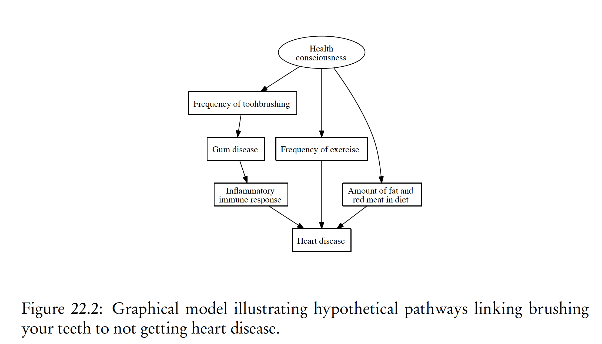
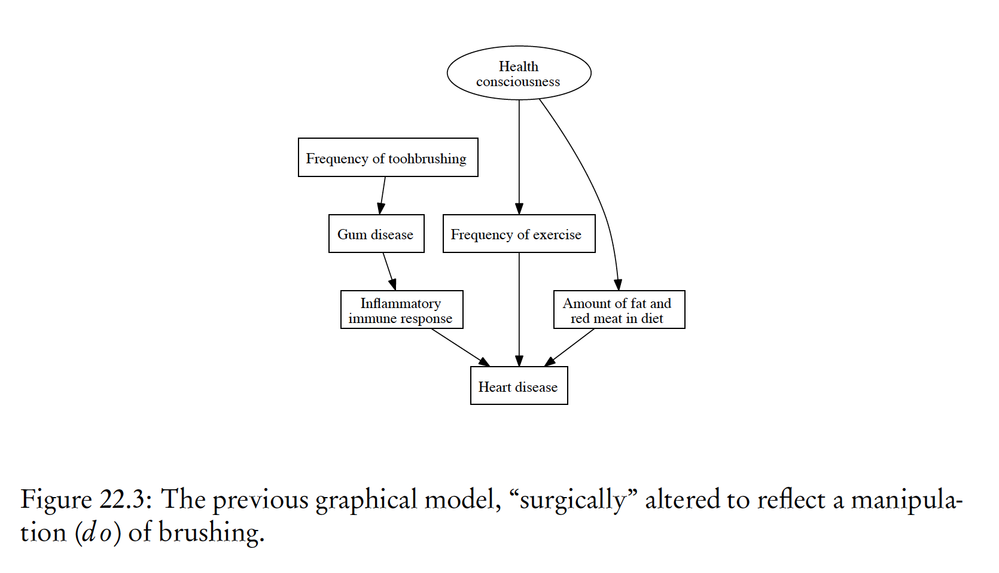
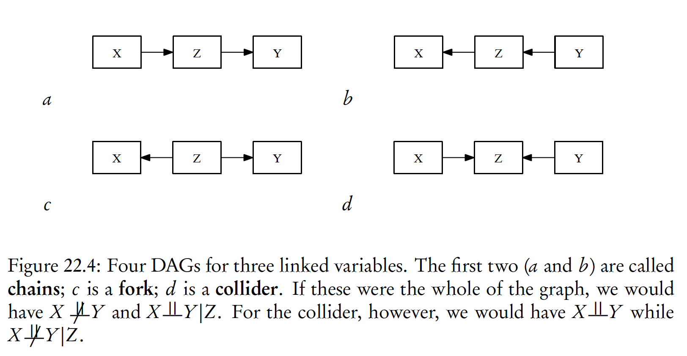
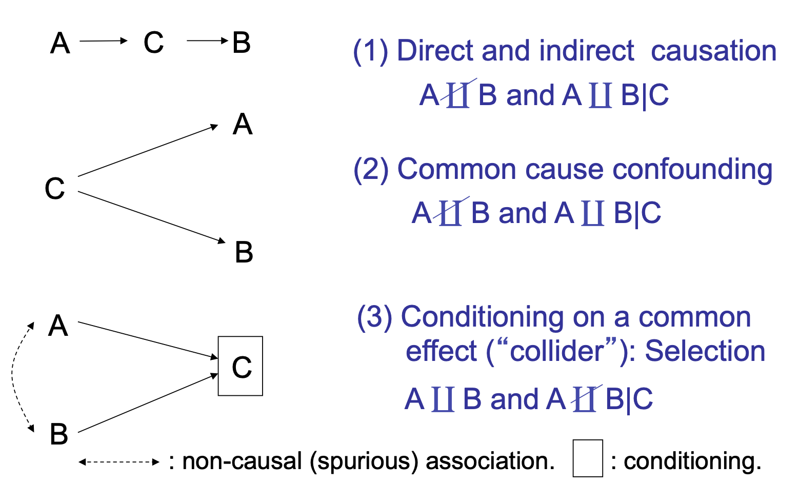
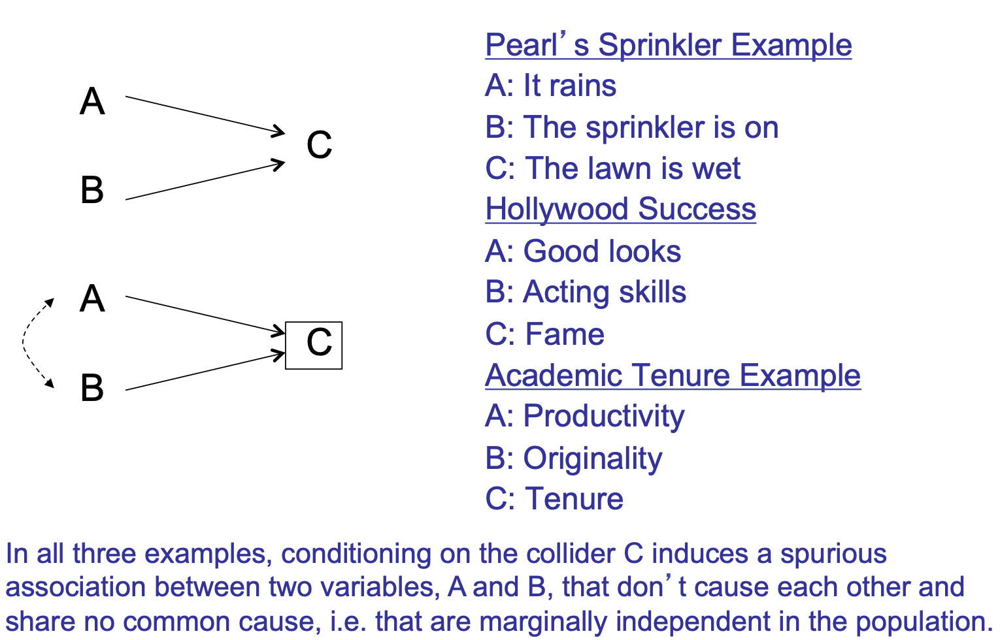
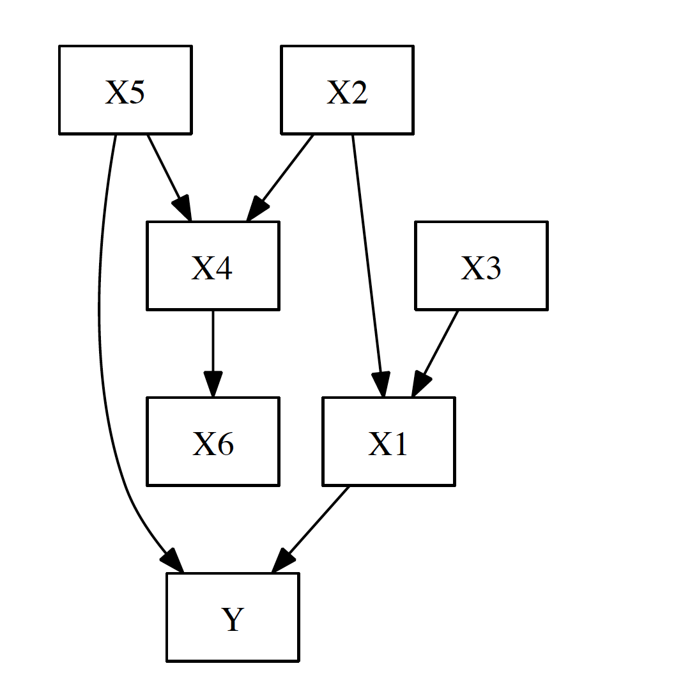
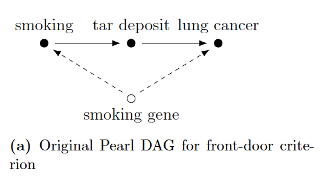
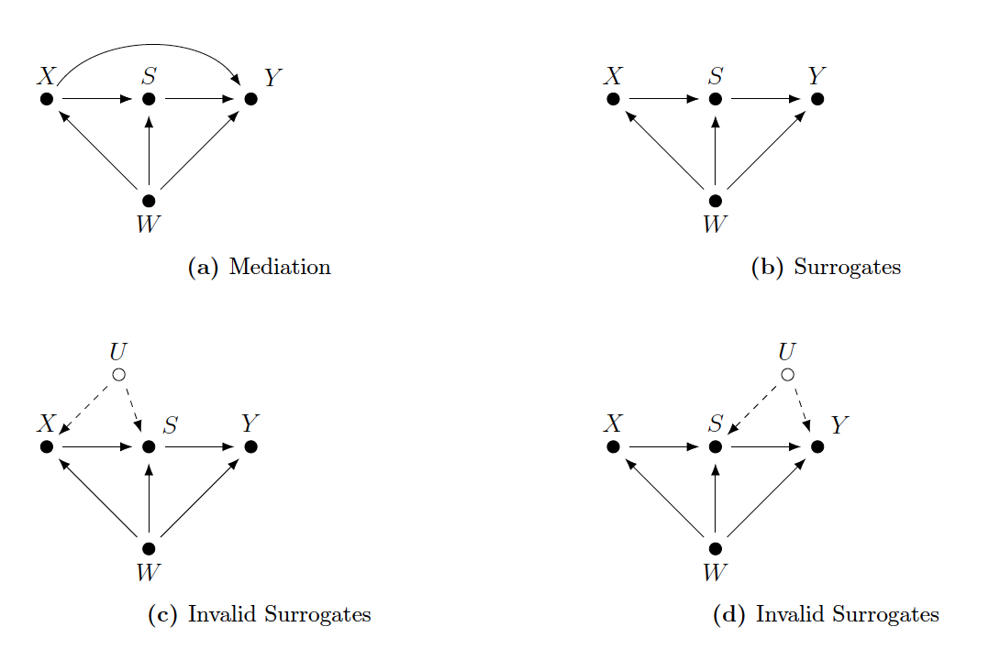

# Today's plan  

- Causal Graph Basics
- Causal Graph v.s. Potential Outcome
 

# Causal Graph

- Each data generation process is a distribution $P(X,Y,D,U)$
  - $X$: observables
  - $Y$: outcome
  - $D$: treatment
  - $U$: unobservables

\pause

- Causal graph can tell us how the distribution looks like, under the assumptions:
  - There is some directed acyclic graph $G$ representing the relations of causation among the our variables.
  - The Causal Markov condition: The joint distribution of the variables obeys the Markov property on $G$.
  - Faithfulness: The joint distribution has all of the conditional independence relations implied by the causal Markov property, and only those conditional independence relations.

- The graph also has the noise term but we ignore them for convenience. 

# Example 1

# Example 1

- We have 
$$
\begin{aligned}
& p(Yellow teeth,Smoking,Asbestos,Tar in lungs,Cancer)\\
= & p(Smoking) p(Asbestos) \\
& \times p(Tar in lungs|Smoking) \\
& \times p(Yellow teeth|Smoking) \\
& \times p(Cancer|Asbestos,Tar in lungs) \\
\end{aligned}
$$
\pause

- We can get any conditional density
- but we also know: $p(Heart disease|Brushing = b) \neq p(Heart disease|do(Brushing = b))$

- We want to make it happen.

# With do calculus

# Conditioning 

- Generally: introducing information about a variable into the analysis by some means (function form is unnecessary).
  - Controlling (e.g. in regression)
  - Subgroup analysis (e.g. restrict analysis to employed women)
  - Sample selection (e.g. only collect data on poor whites)
  - Attrition, censoring, nonresponse (e.g., analyze only respondents or survivors)

# Path

- Path does not take the direction into account

# Coorelation is not causaltion

# Coorelation is not causaltion

# D-separation

- We need some correlation, but it must be causal
- We need to rule out non-causal ones. 

- The concept of d-separation ("directional separation", Pearl 1988) subsumes the three structural sources of association and gives them a name.
- d-separation determines which paths transmit association, and which ones don’t.

# Block and Active

- Consider paths from $X$ to $Y$, and we have a conditioning set $\mathcal{S}$.
- We say If $\mathcal{S}$ **blocks** every undirected path from $X$ to $Y$, then they must be conditionally independent given $\mathcal{S}$. 
- An unblocked path is also called **active**.
- A path is active when every variable along the path is active; if even one variable is blocked
by $\mathcal{S}$, the whole path is blocked.

# Definition

- A variable $Z$ along a path is active, conditioning on $\mathcal{S}$, if
  - $Z$ is a collider along the path, and in $\mathcal{S}$; or,
  - $Z$ is a descendant of a collider, and in $\mathcal{S}$; or
  - $Z$ is not a collider, and not in $\mathcal{S}$.
  
- Turned around, $Z$ is blocked or de-activated by conditioning on $\mathcal{S}$ if
  - $Z$ is a non-collider and in $\mathcal{S}$; or
  - $Z$ is collider, and neither $Z$ nor any of its descendants is in $\mathcal{S}$

# D-separation and Conditional Independence

- In words, $\mathcal{S}$ blocks a path when it blocks the flow of information by conditioning on the middle node in a chain or fork, and doesn’t create dependence by conditioning on the middle node in a collider (or the descendant of a collider). 

- Only one node in a path must be blocked to block the whole path. When $\mathcal{S}$ blocks all the paths between $X$ and $Y$, we say it d-separates them.

- A collection of variables $U$ is d-separated
from another collection $V$ by $\mathcal{S}$ if every $X\in U$and $Y \in V$ are d-separated.

- In every distribution which obeys the Markov property, d-separation implies conditional
independence. If the distribution is also faithful to the graph, then conditional independence also implies d-separation. 

# Example 2

{height=40%}

- Consider $Y$=Grades in Quant2, $X_1$=Efforts spent on Quant2, $X_2$=prior knowledge in statistics, $X_3$=workload this semester, $X_4$=Understanding of Neal, $X_5$=amount learned in Quant1, $X_6$=grades in Quant1
- Is $X_3$ and $X_5$; $X_3$ and $Y$ independent? 
- What should we control?

# Short Summary

- "Blocked" (d-separated) paths don’t transmit association.
- "Unblocked" (d-connected) paths may transmit association.
- Three blocking criteria (key!!)
  - Conditioning on a non-collider blocks a path
  - Conditioning on a collider, or a descendent of a collider, unblocks a path
  - Not conditioning on a collider leaves a path “naturally” blocked.

# Go back to Causality

- **Adjustment Criterion** (Shpitser et al. 2010)

- Total causal effect of $D$ on $Y$ is identifiable if one can condition on (“adjust for”) a set of variables $\mathcal{S}$ that
  - blocks all non-causal paths between $D$ and $Y$
  - without blocking any causal paths between $D$ and $Y$
  
- Equivalently: d-separate $D$ and $Y$ along all non-causal paths while leaving all causal paths d-connected)

# Backdoor Criterion

- The backdoor criterion is a narrower version of the adjustment criterion that omits some unnecessary conditioning sets.

- **Backdoor Criterion** (Pearl 1995)
- Definition: A set of variables $\mathcal{S}$ satisfies the backdoor criterion relative to an ordered pair of variables $(D,Y)$ in a DAG if:
  - no node in $\mathcal{S}$ is a descendant of $D$, and
  - $\mathcal{S}$ blocks (d-separates) every path between $D$ and $Y$ that contain an arrow into $D$ (so-called “backdoor paths”).

- Theorem: The total causal effect of $D$ on $Y$ is non-parametrically identifiable given $\mathcal{S}$ if $\mathcal{S}$} meets the backdoor criterion.

\pause

- This looks familiar: we control confounders and no post-treatment variables.
  - Note this is DAG: so no arrows from $Y$ to $D$
  - Not necessarily confounder itself

# Bias

- It should be intuitive to think about some biases:
  - selection bias (we conditional on $selection=1$)
  - Bias amplification (one case: we control parents but not confounder)
  
\pause  
  - post-treatment bias (we block the causal chain)
  
$$
\begin{aligned}
  & E(Y(1)|D=1, X(1)=x) - E(Y(0)|D=0, X(0)=x) \\
=  & E(Y(1)| X(1)=x) - E(Y(0)| X(0)-x)\ \text{ by random assignment}\\
 = & \int y_1 f_{X(1)}(y_1|x)dy_1 - \int y_0 f_{X(0)}(y_0|x)dy_0\\
 \neq  & E(Y(1)-Y(0)|X=x)
\end{aligned}
$$

# Post-treatment Variables

- But (only) sometimes it can be useful: **Frontdoor Criterion**

{height=30%}

- $D$:smoking; $X$:tar deposit; $Y$:lung cancer
- unobserved $U$: smoking gene

- $P(X|D=d)=P(X|do(d))$, and $P(Y|D=d,X=x)=P(Y|do(x),D=d)$
\pause
- $P(Y|do(d)) =\sum_{d'}\sum_{x}P(Y|X = x;D = d')P(d')P(X=x|D=d)$

# Post-treatment Variables

- Different types of post-treatment variables

# Comparison with Potential Outcome (Imbens 2020)

- They share some common characteristics, however, Imbens argues that
\pause

- Manipulation problem is a concern.
  - There is no intervention $P(Y|do(gender=female))$
  - Hard to access the confounder
    
\pause
- Instrumental variables and compliers
  - some of the key assumptions in instrumental
variables settings are not naturally captured in DAGs,     - the identification of the Local Average Treatment Effect (LATE) is not easily derived in a DAG approach

\pause
- Simultaneity
  - by definition, DAG doesn't allow simultaneity

\pause
- Conditioning set and confounders (what are they)
- Counterfactuals
  - For PO, you need model assumption
  - For DAG, you need a structrual assumption
    
    
# Further readings:

- Elwert, Felix. 2013. "Graphical Causal Models." Handbook of Causal Analysis for Social Research. 
- Pearl, Judea, 2009. Causality. 
- Pearl, Judea, and Dana Mackenzie, 2018, The book of why: the new science of cause and effect. 
- [Guido W. Imbens, 2020, "Potential Outcome and Directed Acyclic Graph Approaches to Causality: Relevance for Empirical Practice in Economics"](https://arxiv.org/abs/1907.07271)

