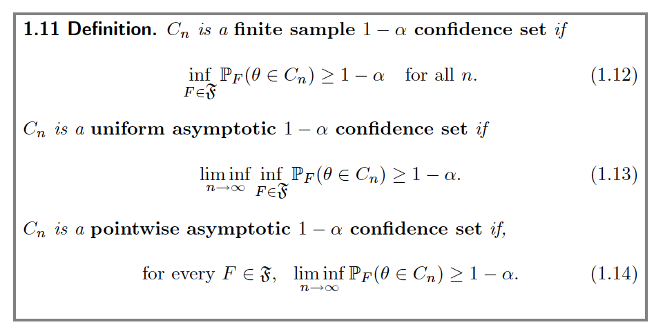

# Outline 

- Asymptotics
- Bootstrap 
- Finite Sample
    
# Inference
- The frequentist perspective: $\mathbf{W}_i = (Y_i, D_i, \mathbf{X}_i)$ is drawn from some unknown distribution $f$.
\pause
- The estimate $\theta$ is a functional of $f$: $\theta = \theta(f)$.
\pause
- Yet $f$ is unknown.
\pause
- We either focus on the limit of $\theta(f)$, $\theta_0$, or use the empirical distribution function, $\hat f$, to approximate $f$.


    
<!-- # Exact variance -->
<!-- - We know that the Neyman variance is conservative. -->
<!-- \pause -->
<!-- - We can do better by using the distribution of the outcome variable. -->
<!-- \pause -->
<!-- - Aronow, Green and Lee (2014): A bound for the covariance of $Y_i(0)$ and $Y_i(1)$ -->
<!-- \pause -->
<!-- - The upper bound is attained if $Y_i(0)$ and $Y_i(1)$ are comonotonic -->
<!-- - The lower bound is attained if $Y_i(0)$ and $Y_i(1)$ are countermonotonic -->
<!-- \pause -->
<!-- - Imbens and Menzel (2018): A causal bootstrap -->

# Asymptotics
- How do we derive the asymptotic distribution of an estimator?
\pause
- Cornerstone: central limit theorem
- The estimator converges to the normal distribution with the speed $\sqrt N$ when the error from each observation is relatively small and independent.

# Asymptotics
- Most estimators in causal inference have the following form:
$$
\hat \tau = \frac{1}{N} \sum_{i=1}^N \phi(\mathbf{W}_i; \beta)
$$
where $\beta$ represents nuisance parameters.
\pause
- For example, in the Horvitz-Thompson estimator, $\phi(\mathbf{W}_i; \beta) = \frac{D_iY_i}{p_i} - \frac{(1-D_i)Y_i}{1-p_i}$.
- $\phi(\mathbf{W}_i; \beta)$ is called the influence function of the estimator $\hat \tau$.
\pause
- When the value of $\beta$ is known, $\hat \tau - \tau$ converges to the normal distribution under some regularity conditions.

# Asymptotics
- When $\beta$ is unknown, we have to take into account the uncertainty from its estimation.
\pause
- This part is more difficult.
\pause
- Usually we need the Delta method (Taylor expansion): $\phi(\mathbf{W}_i; \hat \beta) = \phi(\mathbf{W}_i; \beta) + \phi^{'}(\hat \beta - \beta)$.
\pause
- When the convergence rate of $\beta$ is not too slow, the estimate is still asymptotically normal.
\pause
- What if the parameter is infinite-dimensional?
\pause
- What if the influence function is not smooth?

# Asymptotics
- Or we can do honest inference.
\pause
- Split the sample, use one subsample to estimate the nuisance parameters and the other to estimate the causal effect.
\pause
- Honest inference is popular in techniques based on machine learning.
\pause
- e.g. Ratkovic (2019)

# Asymptotics
- There are other techniques for deriving the asymptotic distribution.
    - Moment generating function
    - Stein's method
\pause
- It is more difficult to derive the asymptotic distribution when the dimension is high.
- Now the number of variables increases at the same speed as the number of observations.
- For example, the empirical covariance no longer converges.

# Asymptotics
- The roadmap if you are interested...
\pause
- Van der Vaart: Asymptotic Statistics (1998)
- Van der Vaart and Wellner: Weak Convergence and Empirical Processes (1996)
- Newey and McFadden: Large sample estimation and hypothesis testing (1994)
- Wainwright: High-Dimensional Statistics: A Non-Asymptotic Viewpoint (2016)


# Bootstrap
- We estimate the distribution $f$ with the estimated $\hat f$, a parameter with infinite dimension.
\pause
- The confidence interval is actually a "plug-in" estimator, but we plug in a function rather than a value.
\pause
- There are different ways of plugging in the $\hat f$.
- How to resample?
- How to calculate the confidence interval?

 
# Bootstrap: Motivation
- Where does it come from?
- $X \sim  F(X|\theta) \to \{x_i\}_{i=1}^n$
- $\hat{\theta}=h(x_1,\dots,x_n)$
- Different samples from  $F(X|\theta)$ produce different $\hat{\theta}$s that estimate the true $\theta$
- Ideally: take different  $\{x_i\}_{i=1}^n$  from $F(X|\theta)$, compute $\hat{\theta}$ for each of them, and get $\hat{\sigma}_{\hat{\theta}}^2$
- But we often have just one sample...
- So, we simulate samples! Parametrically or non-parametrically
 

# Resampling algorithms

- Vanilla bootstrap
- Wild bootstrap
- Cluster bootstrap
- Jackknife

# Bootstrap: nonparametric
- Instead of $X \sim F(X|\theta)$, assume $X \sim  \hat{F}(X|\theta)$
- Our previous sample becomes the new population from which we
sample
- Algorithm:
    - Choose B, number of pseudo-samples
    - Sample $\{x_1^{(1)},\dots,x_n^{(1)}\}$,...,$\{x_1^{(B)},\dots,x_n^{(B)}\}$
    - Compute $\hat{\theta}^{(1)},\dots,\hat{\theta}^{(B)}$

- $\hat{\sigma}^{*2}=\frac{1}{B-1}\sum_{j=1}^{B}(\hat{\theta}^{(j)}-\bar{\hat{\theta}})^2$, where $\bar{\hat{\theta}}=\frac{1}{B}\sum_{j=1}^{B}\hat{\theta}^{(j)}$
- $(1-\alpha)\%$ CI: cut off $\frac{\alpha}{2}\%$ smallest and largest $\hat{\theta}^{(j)}$ values 

 
# Bootstrap: parametric
- Plug $\hat{\theta}$ into $F(X|\theta)$
- Simulate $X \sim F(X|\hat{\theta})$
- Algorithm:
    - Choose B, number of pseudo-samples
    - Sample $\{x_1^{(1)},\dots,x_n^{(1)}\}$,...,$\{x_1^{(B)},\dots,x_n^{(B)}\}$ from $F(X|\hat{\theta})$
    - Compute $\hat{\theta}^{(1)},\dots,\hat{\theta}^{(B)}$
    
- $\hat{\sigma}^{*2}=\frac{1}{B-1}\sum_{j=1}^{B}(\hat{\theta}^{(j)}-\bar{\hat{\theta}})^2$, where $\bar{\hat{\theta}}=\frac{1}{B}\sum_{j=1}^{B}\hat{\theta}^{(j)}$

 

# Construct the confidence interval

- The percentile t-method: $\frac{\hat \theta - \hat \theta^{*}}{\hat \delta^{*}}$
- The percentile method: $\hat \theta - \hat \theta^{*}$
- The Efron method: $\hat \theta^{*}$

```{r dgp, echo=FALSE, size="tiny"}
N_pop <- 100
Y0 <- abs(rnorm(N_pop, 5, 2))
Y1 <- Y0 + rnorm(N_pop, 3, 1)
TE <- Y1 - Y0
ATE <- mean(TE)
nboots <- 1000
D <- rbinom(N_pop, 1, 0.3)
N1 <- sum(D)
N0 <- N_pop - N1
Y <- D*Y1 + (1-D)*Y0
data <- data.frame(Y, D)
HA_est_original <- coefficients(lm(Y~D, data))[2]
e <- residuals(lm(Y~D, data))
se_est_original <- sqrt(var(Y[D==1])/N1 + var(Y[D==0])/N0)

HA_est_boot <- rep(NA, nboots)
HA_est_boot_wild <- rep(NA, nboots)

for (i in 1:nboots){
  data.boot <- data[sample(N_pop, N_pop, replace = 1), ]
  HA_est_boot[i] <- coefficients(lm(Y~D, data.boot))[2]
  w <- rep(1.6180, N_pop)
  w[(rbinom(N_pop, 1, prob = 0.7236) == 1)] <- -0.6180
  data$Y.boot <- HA_est_original*data$D + w*e
  HA_est_boot_wild[i] <- coefficients(lm(Y.boot~D, data))[2]
}
# The percentile t-method
se_boot <- sqrt(var(HA_est_boot))
t_boot <- (HA_est_boot - HA_est_original)/se_boot
CI_perct <- HA_est_original - se_est_original * quantile(t_boot, c(0.975, 0.025))
cat("95% CI from the percentile t-method:", CI_perct, "\n")

# The percentile method
per_boot <- HA_est_boot - HA_est_original
CI_per <- HA_est_original - quantile(per_boot, c(0.975, 0.025))
cat("95% CI from the percentile method:", CI_per, "\n")

# The Efron method
CI_Efron <- quantile(HA_est_boot, c(0.025, 0.975))
cat("95% CI from the Efron method:", CI_Efron, "\n")

```


# Finite Sample

- We might only have small sample (non-asymptotic)
- Example? Small number of cluster, small N in panel, etc. 
\pause

- t distribution
- t-statistics is so called "pivotal-statistics", i.e. not depending on nuisance estimator. 
- deal with finite sample problem better.

# Finite Sample

- Bell-McCaffrey Solution moves the t-distribution to a $\chi^2-$distribution, and find the degree of freedom adjustment for the t distribution. 

- Similar idea with cluster. 

# Comprision of Confidence Set




# Clustering

- Use the cluster SE only when you have clustering in sampling or clustering in design
- Easy to implement using `clubSandwich`

```{R robust-SE}
robust.se <- function(model, cluster){
  require(sandwich)
  require(lmtest)
  M <- length(unique(cluster))
  N <- length(cluster)
  K <- model$rank
  dfc <- (M/(M - 1)) * ((N - 1)/(N - K))
  uj <- apply(estfun(model), 2, function(x) tapply(x, cluster, sum));
  rcse.cov <- dfc * sandwich(model, meat = crossprod(uj)/N)
  rcse.se <- coeftest(model, rcse.cov)
  return(list(rcse.cov, rcse.se))
}
```

# Clustering

- Example: Bertrand, Marianne, Esther Duflo, and Sendhil Mullainathan. "How much should we trust differences-in-differences estimates?." The Quarterly journal of economics 119.1 (2004): 249-275.
- They claims serial correlation in panel data should be taken into account.

\pause

- However, it doesn't solve problems like:
- AR(1) process: $Y_{it}=\alpha Y_{i,t-1}+\beta X$
- Interference: $Y_i(\overrightarrow{D})=Y_i(d_1,d_2,\dots)$

# Take-aways

- Know your data structure and sample.
- Deal with cluster carefully.
- Cluster doesn't solve every problems.
- Correct bootstrap works (most of time).