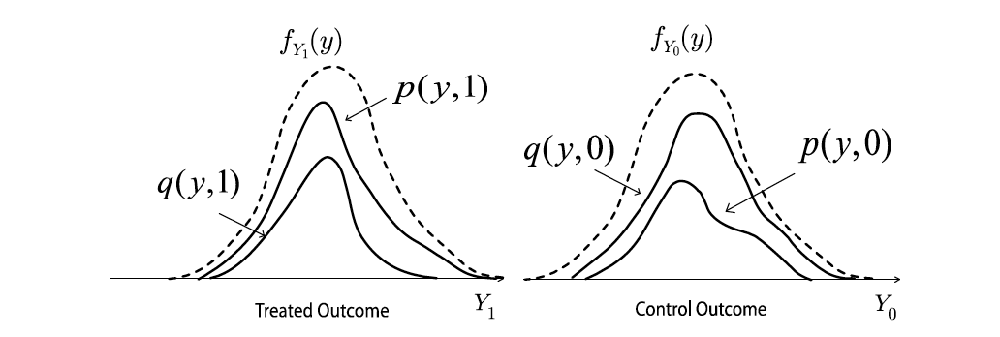
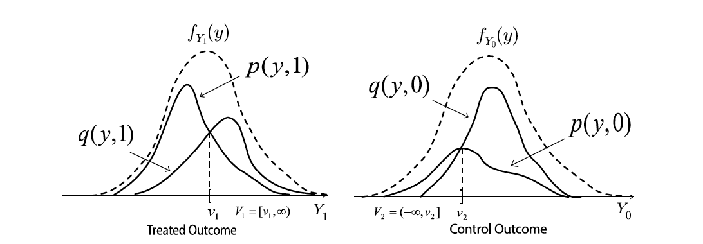
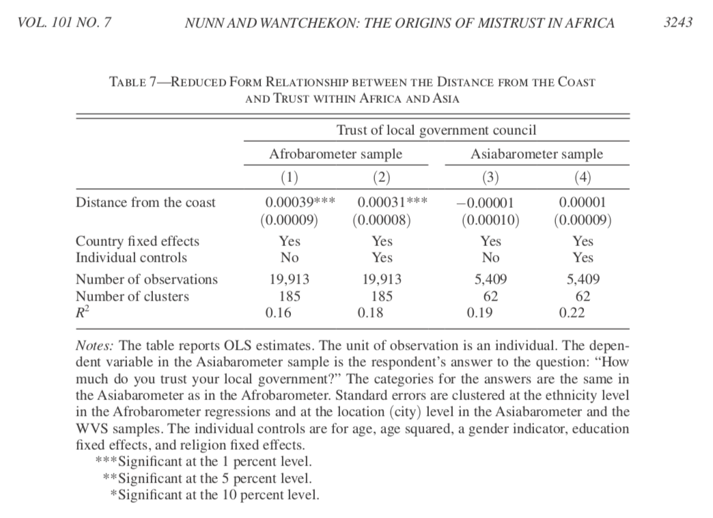

# Outline

- LATE Revisit
- Compliers
- Beyond LATE
- Falsification Tests

# Notice:

- Starting from Sunday, US changes back to daylight saving time.
- Change your clock accordingly!

# LATE
- Principal strata: subsets defined by post-treatment variables
- Eg. ATT, LATE, etc.
- To estimate LATE requires four assumptions:
    - Unfoundedness
    - Exclusion restriction
    - Monotonicity (no defiers)
    - First stage

# LATE
```{R compliance, warning=FALSE, echo=FALSE, message = FALSE}
require(AER)
N_pop <- 100
Y0 <- abs(rnorm(N_pop, 5, 2))
Y1 <- Y0 + rnorm(N_pop, 3, 1)
TE <- Y1 - Y0
ATE <- mean(TE)
nboots <- 1000
LATE_est <- LATE_est_reg <- pi_a_est <- pi_c_est <- pi_n_est <- rep(NA, nboots)
pi_a <- 20
pi_c <- 50
pi_n <- 30
D0 <- D1 <- rep(0, N_pop)
D0[1:20] <- 1
D1[1:70] <- 1
LATE <- mean(TE[21:70])
for (i in 1:nboots){
  # pscore <- runif(N_pop)
  Z <- rep(0, N_pop)
  Z[sample(N_pop, N_pop/2)] <- 1
  N1 <- sum(Z)
  N0 <- N_pop - N1
  D <- D1*Z + D0*(1-Z)
  Y <- D*Y1 + (1-D)*Y0
  d <- data.frame(Y=Y, D=D, Z=Z)
  pi_a_est <- sum(D == 1 & Z == 0)/sum(Z == 0)
  pi_n_est <- sum(D == 0 & Z == 1)/sum(Z == 1)
  pi_c_est <- 1 - pi_a_est - pi_n_est
  # pi_c_est <- sum(D == 0 & Z == 0)/sum(Z == 0) - pi_n_est
  LATE_est[i] <- ((sum(Y*Z)/N1 - sum(Y*(1-Z))/N0))/((sum(D*Z)/N1 - sum(D*(1-Z))/N0))
  LATE_est_reg[i] <- coef(ivreg(Y ~ D | Z, data = d))[2]
  # HA_est[i] <- sum(Y*D/pscore)/sum(D/pscore) - sum(Y*(1-D)/(1-pscore))/sum((1-D)/(1-pscore))
}
plot(density(LATE_est), main = "Bias of the Wald estimator", xlab = "LATE estimates", xlim = c(-5, 10))
abline(v = LATE, lty = 2)
abline(v = mean(LATE_est_reg, na.rm = 1), lty = 1)
```

# LATE
```{R compliance-result, echo=FALSE}
cat("The share of always-takers is", pi_a, "\n", "and the estimate is", mean(pi_a_est), "\n")
cat("The share of never-takers is", pi_n, "\n", "and the estimate is", mean(pi_n_est), "\n")
cat("The share of compliers is", pi_c, "\n", "and the estimate is", mean(pi_c_est))
```

# Consistent and Asymptotic Unbiased
\begin{center}
 $\rho = \frac{\text{Cov}(Y_i,Z_i)}{\text{Cov}(D_i,Z_i)} = \frac{ \frac{ \text{Cov}(Y_i,Z_i)}{\text{Var}(Z_i)}}{\frac{\text{Cov}(D_i,Z_i)}{\text{Var}(Z_i)}} = \frac{\text{Reduced form}}{\text{First stage}}$
 \end{center}
- 2SLS is consistent and asymptotic unbiased, but biased. 
- The key is: $E(\frac{1}{\bar{X}})\neq \frac{1}{E(X)}$, although $\frac{1}{\bar{X}}\to \frac{1}{E(X)}$
- Finite sample bias
\pause
- The asymptotic bias is a function of both violation of exclusion restriction and of strength of first stage. 
- One can show  for the asymptotic bias to be small you want
  - cov($\tilde{Z_i} ; \tilde{U_i}$) to be small
  - cov( $\tilde{Z_i} ; \tilde{D_i}$) to be large 
- With an irrelevant instrument ($F=0$), the bias is equal to that of OLS (regression of $Y$ on $X$).
- Weak instrument may cause huge bias: signal is small compared to noise. 


# With Covariates

- We can identify the LATE for compliers
- What if we have conditional independence of $Z_i$? Or if we just want to add covariates.
\pause
- Functional form may be misspecified and we need nonparametric or semi-parametric model.


# Abadie's (2003) $\kappa$

- Recall from the lecture that we can use a weighting scheme to calculate
  statistics on the compliant population, that comes from Abadie (2003)

$$
\begin{aligned}
\kappa = 1 - \frac{D_i (1-Z_i)}{p(Z_i =0|X)} - \frac{(1-D_i)Z_i}{p(Z_i =1|X)}
\end{aligned}
$$

$$
\begin{aligned}
 E[\kappa|X] = E[D_1 -D_0|X] = E[D|X,Z=1] - E[D|X,Z=0]
 \end{aligned}
$$

# Abadie's $\kappa$

- So, weighting by $\frac{\kappa_i}{E[D_{1}-D_{0}|X_i]}$ and then
computing the usual sample statistics allows you to characterize
compliers’ attributes.
- Use this in calculating any interesting statistics (means, variance, etc)
- This let's you explore the units composing your LATE.

# Abadie's $\kappa$

- Moreover, as shown in Theroem 3.1 (Abadie,2003)
- Weighting by $\kappa_i$ in your object function help to identify LATE with covariates 
- For any measurable function $g(Y,D,X)$

$$
E(g(Y,D,X)|D_1>D_0)=\frac{1}{Pr(D_1>D_0)}E(\kappa g(Y,D,X))
$$

\pause
- Therefore one can solve 

$$
\begin{aligned}
\theta_0 &  = \underset{\theta \in \Theta}{\text{arg min}
}E[\kappa\{Y-h(D,X;\theta)\}^2] \\
& = \underset{\theta \in \Theta}{\text{arg min}
}E[\{E[Y|D,X,D_1>D_0]-h(D,X;\theta)\}^2|D_1>D_0]
\end{aligned}
$$

# From LATE to ATE
- We can calculate the principal strata score using covariates.
- Although we do not know the strata each observation belongs to, it is still possible to fit a MLE to maximize the probability for the assignment ($\mathbf{D}, \mathbf{Z}$) to occur.
- Based on these scores we can weight LATE to get ATE.
- Aronow and Carnegie (2013); Bisbee et al. (2015); Ding and Lu (2016); Feller et al. (2018)

# Aronow and Carnegie (2013): Beyond LATE

- Idea: Complier is determined by observed covariates, but whether you are a complier is unknown.
- We can identify the probability or 
  - You are a complier or always taker $P_{A,C,i}=Pr(D_1>D_0 \cup D_0=1|X=x_i)=F(\theta_{A,C}x_i)$, and
  - You are an always-taker conditional you are a complier or always taker. $P_{A|A,C,i}=Pr(D_0=1|D_1>D_0 \cup D_0=1,X=x_i)=F(\theta_{A|A,C}x_i)$
  - Compliance score: $P_{Ci}=Pr(D_1>D_0|X=x_i)=F(\theta_{A,C}x_i)(1-F(\theta_{A|A,C}x_i))$

\pause

- Then follow the same idea of IPW.
- Hinge on the assumption that complier status is determined by $X$, so $E(Y_1-Y_0|starta,X)=E(Y_1-Y_0|X)$.

# Many instrumental variables
- Conventional approach: GMM
    - Each IV gives a moment condition
    - Use GMM to combine all the conditions
- Modern approach: LASSO
    - The first stage is a prediction problem
    - Hence we can use all kinds of ML algorithms to fit the first stage
    - The concern is whether the approach leads to valid estimates


<!-- # Instrumental variables in practice -->
<!-- - Dark arts in social sciences -->
<!-- - It requires deep understanding of the underlying structure. -->

# IV test

- A recently developed branch of the literature
- The exclusion restriction alone cannot be tested.
- But we can test its combination with the monotonicity assumption.
- $P(y, D = 1 | Z = 1) > P(y, D = 1 | Z = 0)$ and $P(y, D = 0 | Z = 1) < P(y, D = 0 | Z = 0)$

{width=40%} {width=40%}
\pause
```
D <- D1*Z + D0*(1-Z)
Y <- D*Y1 + (1-D)*Y0  
```

```{R IV test, echo=FALSE}
require(AER)
N_pop <- 1000
Y0 <- abs(rnorm(N_pop, 5, 2))
Y1 <- Y0 + rnorm(N_pop, 5, 1) 
D0 <- D1 <- rep(0, N_pop)
D0[1:200] <- 1
D1[1:800] <- 1 
Z <- rep(0, N_pop)
Z[sample(N_pop, N_pop/2)] <- 1
N1 <- sum(Z)
N0 <- N_pop - N1
D <- D1*Z + D0*(1-Z)
Y <- D*Y1 + (1-D)*Y0  
d <- data.frame(Y=Y, D=D, Z=Z) 
Y_11 <- Y[D == 1 & Z == 1]
Y_10 <- Y[D == 1 & Z == 0]
Y_01 <- Y[D == 0 & Z == 1]
Y_00 <- Y[D == 0 & Z == 0]

```

# IV test
```{R IV test plot1, echo=FALSE}
plot(density(Y_11), main = "Density of the outcome (treated)", xlim = c(-5, 20))
lines(density(Y_10), lty = 2)

```

# IV test
```{R IV test plot2, echo=FALSE}
plot(density(Y_00), main = "Density of the outcome (control)", xlim = c(-5, 20))
lines(density(Y_01), lty = 2)
```

# IV test

- When exclusion restriction is violated. 

```
D <- D1*Z + D0*(1-Z)
Y <- D*Y1 + (1-D)*Y0 + 10*Z 
```

```{R IV test2, echo=FALSE}
require(AER)
N_pop <- 1000
Y0 <- abs(rnorm(N_pop, 5, 2))
Y1 <- Y0 + rnorm(N_pop, 5, 1)  
D0 <- D1 <- rep(0, N_pop)
D0[1:200] <- 1
D1[1:800] <- 1 
Z <- rep(0, N_pop)
Z[sample(N_pop, N_pop/2)] <- 1
N1 <- sum(Z)
N0 <- N_pop - N1
D <- D1*Z + D0*(1-Z)
Y <- D*Y1 + (1-D)*Y0  +  10*Z
d <- data.frame(Y=Y, D=D, Z=Z) 
Y_11 <- Y[D == 1 & Z == 1]
Y_10 <- Y[D == 1 & Z == 0]
Y_01 <- Y[D == 0 & Z == 1]
Y_00 <- Y[D == 0 & Z == 0]

```

# IV test
```{R IV test plot21, echo=FALSE}
plot(density(Y_11 ), main = "Density of the outcome (treated)", xlim = c(-5, 20))
lines(density(Y_10), lty = 2)

```

# IV test
```{R IV test plot22, echo=FALSE}
plot(density(Y_00), main = "Density of the outcome (control)", xlim = c(-5, 20))
lines(density(Y_01), lty = 2)
```


# Falsification 

- Another approach: following the mechanism. 

- Test the reduced form effect of $Z_i$ on $Y_i$ in situations where it is impossible or extremely unlikely that $Z_i$ could affect $D_i$ .

- Because $Z_i$ can’t affect $D_i$, then the exclusion restriction implies that this falsification test should have 0 effect.

- Nunn & Wantchekon (2011): use distance to coast as an instrument for Africans, use distance to the coast in an Asian sample as falsification test


# Falsification

